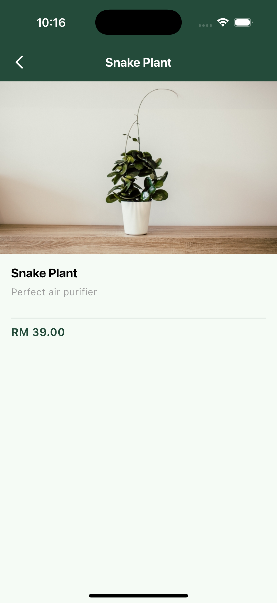
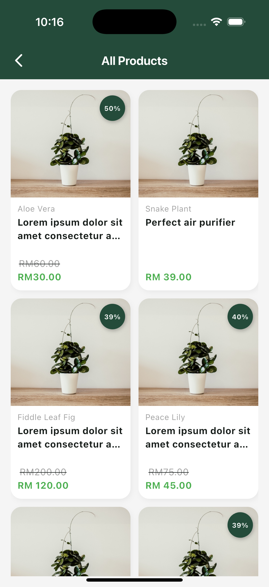
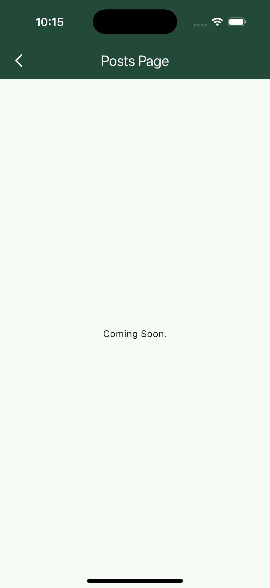

# dataflows_assessment

A new Flutter project.

## Getting Started

This project is a starting point for a Flutter application.

A few resources to get you started if this is your first Flutter project:

### Assets configuration

Configure asset images using the following command

```sh tools/internal/echo_asset_metadata.sh > lib/app/assets/assets.g.dart```

## Project Architecture Pattern (MVVM)

In this project, MVVM, aka Model-View-ViewModel is adapted as the base project architecture pattern. MVVM is useful to
move business logic from view to ViewModel and Model. ViewModel is the mediator between View and Model which carry all
user events and return back the result.
To learn more, may refer to [MVVM by Tech Madness] for a more detailed explaination.

In summary, core idea/components for MVVM in this starter project are:

1. Model - Represent the source of data, this layer mainly communicate with ViewModel layer for data fetching/api
   call/data validation
2. ViewModel - Act as the mediator between View and Model, which accept all the user events and request and forwarding
   to Model for data. Once the Model has data then it returns to ViewModel and then ViewModel notify that data to View.
3. View - This is the layer where widgets/layout is presenting the data to user, for any user action/requests, it will
   forward to ViewModel layer and get updated once job completed in ViewModel and Model layer.

### Model Layer

1. Model data class is defining the structure of data to be used

   ```dart
   class TokenModel {

     TokenModel({this.accessToken, this.refreshToken});

     String? accessToken;
     String? refreshToken;
   }
   ```

3. Repository class is defining the business logic for accessing data source, eg: getting data from multiple source and
   compiled as one data type before passing back to ViewModel.

   ```dart
   class UserRepository {
      UserServices _userServices = UserServices();

      Future<MyResponse> login(String username, String password) async {
        return await _userServices.login(username, password);
      }
   }
   ```

### View Model Layer

1. ViewModel class as a connector between View and Model, separating View and Model to segregate business logic from UI,
   by accepting all request from View and perform related request through Model Layer.
2. One ViewModel class may serve multiple View classes. (ensuring Extensibility and Maintainability).

### View Layer

1. View layer are the presentation layer, where include all the UI classes, eg: Widgets, Pages

## State Management Tool

This project relies on [Provider] which taking the [Official_Simple app state management] as base reference. [Provider]
is use along with MVVM architectural pattern to provide better separation and management within the project.

Core concepts in [Provider]:

1. [ChangeNotifier]
2. [ChangeNotifierProvider]
3. [Provider.Of]

### Using the Provider

1. To simplified and standardize the usage of Provider in this project, a base class, base_view_model.dart is provided
   which extending the ChangeNotifier and include common functions/fields required. (eg: notify(), notifyUrgent() and
   more)
2. ChangeNotifierProviders are implemented in the top inheritance level of the project (app.dart) which using
   MultiProvider to support multiple providers within the project.
3. For any new ViewModel class/Provider, please register in the `lib/app/asset/app_options.dart`

```dart
List<SingleChildWidget> providerAssets() =>
    [
      ChangeNotifierProvider(create: (_) =>
      ProductViewModel()
        ..loadProducts()),
      ChangeNotifierProvider(create: (_) =>
      AppointmentViewModel()
        ..loadAppointment()),
    ];
```

## Routing with Go_Router

This project using router to navigating between screens and handling deep
links. [go_router](https://pub.dev/packages/go_router) package is used which can help to parse the route path and
configure the Navigator whenever the app receives a new deep link.

### Declaring Routes

1. `lib/app/assets/router/app_router.dart` is the main class to provide the configuration of the routes.
2. For any new screens or new routes, you may add in
   the [GoRoute](https://pub.dev/documentation/go_router/latest/go_router/GoRoute-class.html) object into
   the [GoRouter](https://pub.dev/documentation/go_router/latest/go_router/GoRouter-class.html) constructor.

#### GoRoute

To configure a `GoRoute`, a path template and builder must be provided. Specifiy a path template to handle by providing
a `path` parameter, and a builder by providing either the `builder` or `pageBuulder` parameter:

```dart

final GoRouter router = GoRouter(routes: [
  GoRoute(path: '/login', builder: (context, state) => LoginPage())
]);
```

#### Child Routes

A matched route can result in more than one screen being displayed on a Nvigator. This is equivalent to calling `
push()', where a new screen is displayed above the previous screen with a transition animation.

To display a screen on top of another, add a child route by adding it to the parent route's `routes' list:

```dart

final GoRouter router = GoRouter(routes: [
  GoRoute(path: '/login', builder: (context, state) => LoginPage()),
  GoRoute(path: 'profile', builder: (context, state) => HomePage(initialIndex: 4), routes: [
    GoRoute(
        path: 'editProfile',
        builder: (context, state) => EditBasicInfoPage(),
        routes: [
          GoRoute(path: 'changePhoneNumber', builder: (context, state) => ChangePhoneNumberPage())]),
    GoRoute(path: 'changeLanguage', builder: (context, state) => LanguageListPage())
  ])
]);
```

## Working with Translations 🌐

This project relies on [flutter_localizations][flutter_localizations_link] and follows
the [official internationalization guide for Flutter][internationalization_link].

1. To add a new localizable string, open the `intl_en.arb` file at `lib/l10n/intl_en.arb`.

```arb
{
    "@@locale": "en",
    "counterAppBarTitle": "Counter",
    "@counterAppBarTitle": {
        "description": "Text shown in the AppBar of the Counter Page"
    }
}
```

2. Then add a new key/value and description

```arb
{
    "@@locale": "en",
    "counterAppBarTitle": "Counter",
    "@counterAppBarTitle": {
        "description": "Text shown in the AppBar of the Counter Page"
    },
    "helloWorld": "Hello World",
    "@helloWorld": {
        "description": "Hello World Text"
    }
}
```

3. Use the new string

```dart

@override
Widget build(BuildContext context) {
  return Text(S.current.helloWorld);
}
```

#### Adding Translations

1. For each supported locale, add a new ARB file in `lib/l10n`.

```
├── l10n
   ├── intl_en.arb
   └── intl_ms.arb
```

2. Add the translated strings to each `.arb` file:

`intl_en.arb`

```arb
{
    "@@locale": "en",
    "counterAppBarTitle": "Counter",
    "@counterAppBarTitle": {
        "description": "Text shown in the AppBar of the Counter Page"
    }
}
```

`intl_ms.arb`

```arb
{
    "@@locale": "ms",
    "counterAppBarTitle": "Kaunter",
    "@counterAppBarTitle": {
        "description": "Teks ditunjukkan dalam AppBar bagi Halaman Kaunter"
    }
}
```

### Adding Supported Locales

Update the `CFBundleLocalizations` array in the `Info.plist` at `ios/Runner/Info.plist` to include the new locale.

```xml
    ...

<key>CFBundleLocalizations</key>    <array>
<string>en</string>
</array>

    ...
```




